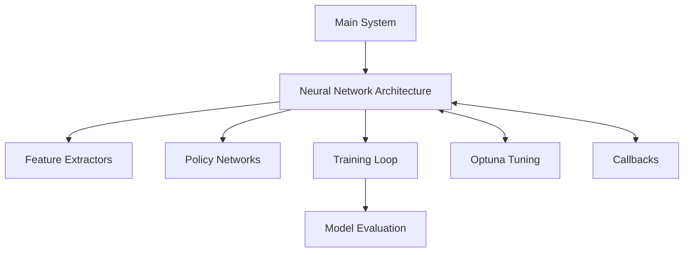

# MTG-RL: A Reinforcement Learning Agent for Magic: The Gathering

This project implements a reinforcement learning agent that learns to play Magic: The Gathering through self-play. It uses the Stable Baselines 3 framework with a customized PPO (Proximal Policy Optimization) implementation for training.

## Project Overview

MTG-RL simulates the core mechanics of Magic: The Gathering and uses deep reinforcement learning to train an agent that can make strategic decisions during gameplay. The agent learns card evaluation, combat decisions, resource management, and long-term planning.

## Project Architecture



## Other Parts

- DeckStat_Viewer is from a far earlier version and doesn't work

## TODO

- Current state: Doesn't work, working on version 3.00

- Add support for coin flips and dice rolls
- Add support for {2/B} style mana
- Bug fix deck_stat_tracker.py (inconsistent stats?)
- Add a better MD5 hash to saving decks, one that includes card count in deck_stat_tracker.py
- Add support for "Start your engines"
- Overhaul DeckStats_Viewer to work with the current versions of the deck_stat_tracker and card_memory.py
- General Bug fixing needs to be done, need to integrate other stuff
- Add support for Delirium
- Add support for Domain
- Add support for Valiant
- Add support for Plot
- Add support for Eerie


### Key Features

- **Complete MTG Game Engine**: Implements core rules and mechanics including phases, stack resolution, combat, and state-based actions
- **Custom Neural Network Architecture**: Specialized feature extractors and policy networks for MTG's complex state space
- **Comprehensive Training Pipeline**: Optimized PPO implementation with custom callbacks for monitoring and logging
- **Advanced Gameplay Systems**:
  - Combat resolution with combat tricks and blocking strategies
  - Mana system with proper color requirements
  - Card synergy evaluation
  - Multi-turn planning
  - Strategic memory for pattern recognition

## Neural Network Architecture

The model uses a custom architecture designed specifically for the structure of MTG:

- **CompletelyFixedMTGExtractor**: Custom feature extractor that processes different observation types:
  - Battlefield state (creatures, planeswalkers, etc.)
  - Hand contents
  - Game phase encoding
  - Life totals and other game metrics
  - Resource availability
  
- **FixedDimensionMaskableActorCriticPolicy**: Policy network that uses action masking to ensure only legal actions are selected.

- **LSTM Integration**: Uses recurrent layers to capture sequential decision making and maintain game state memory.

## Prerequisites

- Python 3.8+
- PyTorch 1.10+
- Stable Baselines 3
- Gymnasium
- Numpy, Pandas, Matplotlib (for analysis and visualization)


## Usage

### Training an Agent

```bash
python main.py --timesteps 1000000 --learning-rate 3e-4 --batch-size 256
```

### Hyperparameter Optimization

```bash
python main.py --optimize-hp --n-trials 50
```

### Testing a Trained Agent

```bash
python main.py --resume models/trained_model --timesteps 10000
```

## Command Line Arguments

- `--resume`: Path to a model to resume training from
- `--timesteps`: Total timesteps to train (default: 1000000)
- `--eval-freq`: Evaluation frequency (default: 10000)
- `--checkpoint-freq`: Checkpoint frequency (default: 50000)
- `--learning-rate`: Initial learning rate (default: 3e-4)
- `--batch-size`: Batch size for training (default: 256)
- `--n-steps`: Number of steps to collect before training (default: 2048)
- `--n-envs`: Number of environments to run in parallel (0 = auto)
- `--debug`: Enable additional debugging
- `--optimize-hp`: Run hyperparameter optimization
- `--record-network`: Enable detailed network recording
- `--record-freq`: Frequency for recording network parameters
- `--cpu-only`: Force CPU training even if GPU is available

## Monitoring Training

The project uses TensorBoard for monitoring training progress. Various metrics are logged including:

- Reward progression
- Win rates
- Action distributions
- Network parameter changes
- Resource usage (CPU/GPU/Memory)

To view training progress:

```bash
tensorboard --logdir=tensorboard_logs
```

## Customization

### Custom Training Configurations

Modify the `CustomLearningRateScheduler` and network architecture parameters in `main.py` to experiment with different learning configurations.

## Advanced Features

### Strategic Memory

The agent builds a memory of effective strategies and patterns throughout training. This is implemented in `strategy_memory.py`.

### Card Evaluation

The `enhanced_card_evaluator.py` module provides context-aware card evaluation that considers:

- Board state
- Hand composition
- Current game phase
- Historical performance of the card

### Multi-turn Planning

The agent attempts to plan multiple turns ahead using the `strategic_planner.py` module, which uses a simplified simulation of future game states.

## License

This project is licensed under the Apache License 2.0 - see the [LICENSE](LICENSE) file for details.

### What this means:

- You are free to use, modify, and distribute this software
- You must include the original copyright notice and license
- You must document any significant changes made to the code
- You must include proper attribution to this project

## Acknowledgments

This project uses elements from:

- [Stable Baselines 3](https://github.com/DLR-RM/stable-baselines3)
- [SB3-Contrib](https://github.com/Stable-Baselines-Team/stable-baselines3-contrib)
- [Gymnasium](https://github.com/Farama-Foundation/Gymnasium)

## Contact

For questions or contributions, please open an issue on the GitHub repository.