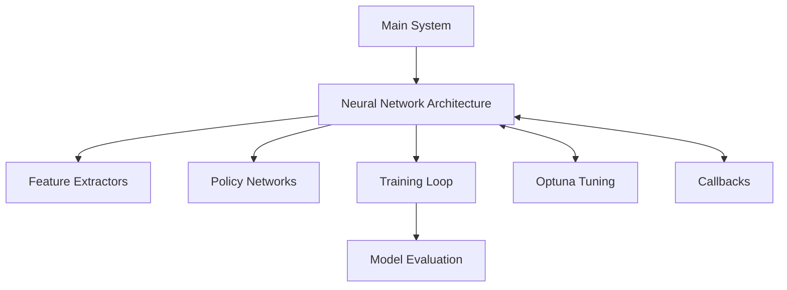

# MTG-RL: A Reinforcement Learning Agent for Magic: The Gathering

This project implements a reinforcement learning agent for two-player Magic: The Gathering. It uses Stable Baselines 3 with mask-aware PPO; the current training default plays a scripted opponent, while the Harvest protocol supports checkpoint-vs-checkpoint evaluation and promotion.

## Project Overview

MTG-RL simulates the core mechanics of Magic: The Gathering and uses deep reinforcement learning to train an agent that can make strategic decisions during gameplay. The agent learns card evaluation, combat decisions, resource management, and long-term planning.

## Project Architecture


```mermaid
graph TD
    A[Main System] --> B[Neural Network Architecture]
    B --> C[Feature Extractors]
    B --> D[Policy Networks]
    B --> E[Training Loop]
    B <--> F[Optuna Tuning]
    B <--> G[Callbacks]
    E --> H[Model Evaluation]
```

## Other Parts

- DeckStat_Viewer is from a far earlier version and doesn't work

## Current Status

The engine, stats pipeline, and training smoke path are operational. Rules and
card coverage are still expanding; [ROADMAP.md](ROADMAP.md) is the authoritative
status and next-work list. `DeckStats_Viewer` remains a legacy component and is
not part of the current verification gates.


### Key Features

- **Complete MTG Game Engine**: Implements core rules and mechanics including phases, stack resolution, combat, and state-based actions
- **Custom Neural Network Architecture**: Specialized feature extractors and policy networks for MTG's complex state space
- **Comprehensive Training Pipeline**: Optimized PPO implementation with custom callbacks for monitoring and logging
- **Advanced Gameplay Systems**:
  - Combat resolution with combat tricks and blocking strategies
  - Mana system with proper color requirements
  - Card synergy evaluation
  - Heuristic multi-turn planning features
  - Strategic memory for pattern recognition

## Neural Network Architecture

The model uses a custom architecture designed specifically for the structure of MTG:

- **FixedWindowMTGExtractor**: Custom feature extractor that processes different observation types:
  - Battlefield state (creatures, planeswalkers, etc.)
  - Hand contents
  - Game phase encoding
  - Life totals and other game metrics
  - Resource availability
  
- **FixedDimensionMaskableActorCriticPolicy**: Policy network that uses action masking to ensure only legal actions are selected.

- **Gated feature block**: The current extractor applies an LSTM-shaped gated
  transform to a length-one input. Its parameters train, but hidden state is not
  carried between policy calls, so this is not a recurrent policy yet.

## Prerequisites

- Python 3.8+
- PyTorch 1.10+
- Stable Baselines 3
- Gymnasium
- Numpy, Pandas, Matplotlib (for analysis and visualization)


## Usage

### Verification

Run these from the repository root before training or changing engine rules:

```bash
python tests/smoke_test.py
python tests/scenario_test.py
python tests/train_smoke_test.py
python tests/deck_ingest_test.py
python tests/harvest_fixtures_test.py
python tests/harvest_protocol_test.py
python tests/invariant_fuzz_config_test.py
python tests/invariant_fuzz_test.py --profile default
```

On Windows, the checked-out virtual environment can be used explicitly with
`.\MTGenv\Scripts\python.exe` in place of `python`.

### Sample-Deck Support Harvest

The fixture harvester rotates through all eight audited decks by default and
requires a fresh output directory. It rejects reset fallbacks, degraded or
out-of-space observations, mask-valid execution failures, mask-invalid
checkpoint choices, aborted games, corrupt compressed data, and cross-file
count mismatches, then writes `harvest_run.json` as its success marker.

```bash
python harvest_fixtures.py --seed 20260710 --output harvest_runs/seed_20260710
```

This random-valid-vs-scripted run is for plumbing and support-manifest coverage;
its win rates are not card- or deck-strength evidence.

### Long-game invariant fuzzing

The deterministic runner has `short` (300 actions), `default` (8,000 actions),
and `long` (320,000 actions) profiles. A successful run creates no artifact
directory. On failure it writes an atomic JSON payload containing the exact
seed, actions, contexts, and state needed for replay.

```bash
python tests/invariant_fuzz_test.py --profile long --artifact-dir fuzz_failures
python tests/invariant_fuzz_test.py --replay fuzz_failures/invariant_fuzz_seed_1701.json
```

The long profile also runs weekly and on demand through
`.github/workflows/long-game-fuzz.yml`; failed-run replay files are retained as
CI artifacts for 14 days.

### Parallel checkpoint harvest and promotion

Production harvesting uses isolated worker directories and publishes
`harvest_protocol.json` only after every shard passes the strict fixture
contract. Checkpoints are stamped by filename, size, and SHA-256 digest.

```bash
python harvest_protocol.py harvest --games 256 --workers 4 \
  --agent-model models/candidate.zip --opponent-model models/champion.zip \
  --output harvest_runs/candidate

python harvest_protocol.py promote --games 64 --workers 4 \
  --candidate models/candidate.zip --baseline models/champion.zip \
  --minimum-score 0.55 --output harvest_runs/promotion_001
```

Promotion evaluates the candidate in both seats and requires both the score
threshold and a clean fidelity/severe-support manifest. The protocol is ready,
but a real promotion requires trained candidate and baseline checkpoints.

### Training an Agent

The default training and Harvest pool is rooted at `formats/standard/decks` and
is loaded recursively. The pinned representative metagame lives under its
`metagame/` subdirectory; user-supplied decks live separately under
`imported/`. Regenerate only the simulator-ready metagame files from the
reviewable compact corpus and pinned card snapshot with:

```bash
python -m Playersim.deck_corpus --replace
```

### Importing a deck list

Supply an Arena/simple-text list (`4 Card Name`, with optional `Deck`,
`Sideboard`, and `Maybeboard` headings) or a compact JSON list. Validate it
without changing the pool, then import it with:

```bash
python -m Playersim.deck_ingest path/to/my_deck.txt --dry-run
python -m Playersim.deck_ingest path/to/my_deck.txt
```

The importer resolves cards against the pinned format snapshots, enforces
60-card constructed legality, sideboard and copy limits, and reports every
matching format. Without an override it selects the narrowest supported match
in `Standard -> Pioneer -> Modern` order; use `--format modern` to require a
specific legal format. A 1,000-card simulator safety cap rejects typo-sized
lists before counts are expanded in memory. A successful import writes a
hydrated deck to `formats/<format>/decks/imported/`, where training and Harvest
discover it through the recursive pool loader.

Sideboard cards participate in legality checks and are retained in the imported
JSON, but the current best-of-one runtime does not play them. The reported
support-status slots and `--strict-support` check therefore cover the main deck;
strict mode rejects main-deck cards whose ledger status is `unparsed`, `crash`,
or `excluded`. Maybeboard entries are reported and ignored. `--replace` is
required to update the same named import. If a complete frozen namespace does
not exist, the importer can bootstrap it from that format's pinned snapshot;
pass `--no-bootstrap-namespace` to require one to exist already.

Harvest requires at least two decks in the selected pool; a first import can
be validated and loaded immediately, but cannot form a Harvest matchup alone.

Before widening a format corpus, regenerate its static support ledger:

```bash
python -m Playersim.support_preflight --snapshot "Format Card Lists/standard.jsonl" \
  --registry formats/standard/card_registry.json \
  --decks formats/standard/metagame_corpus_2026-07-11.json \
  --corpus-label representative-meta-2026-07-11 \
  --overrides formats/standard/support_overrides.json --format standard \
  --output formats/standard/support_ledger.json
```

Current Standard preflight (July 12, 2026): 68 verified, 89
observed-clean, 3,565 unseen-clean, 809 partial, and 171 unparsed cards across
the 4,702-card pool. That is 79.1578051893% static-clean coverage and
3.3390046789% evidence-qualified coverage. The representative metagame has no
`unparsed` or `crash` cards and two acknowledged `partial` multi-face entries:
Emeritus of Ideation and Esper Origins. Its Warp, linked-search, temporary-rule,
outside-game, Crew, and zone-transaction paths are executable and scenario-
guarded. Generic Equip/Crew, fixed Discover, Connive, Suspect, Explore,
Investigate, and nonland-permanent Airbend support account for the latest
full-pool sweep. Spell-mana-value Discover, repeated Explore, common dynamic
Investigate counts, and Endure are also executable. Optional resolution mana
payments and paginated spell/activated X choices now share the fixed action schema;
unsupported nonmana payment gates and other compound/dynamic variants remain
conservatively partial.

```bash
python main.py --timesteps 1000000 --learning-rate 3e-4 --batch-size 256 --seed 20260710
```

No format or deck flags are required for the pinned Standard default. Custom
corpora remain available through `--decks`, `--format`, and `--format-dir`.

Training and evaluation use separate statistics directories and alternate the
learned policy between P1 and P2 on successive episodes. Each run also writes a
`training_run.json` provenance manifest under its model directory, recording the
seed, Git revision and dirty state, CLI and resolved configuration, device and
runtime dependencies, deck provenance, lifecycle result, and artifact paths. A
dirty run also stores a hashed `source_worktree.patch` beside the manifest so
the exact tracked source delta is retained.

> **Checkpoint boundary (Round 7.49):** the full Standard namespace widened
> card observations to 436 fields (including 259 subtype fields and MDFC fields), signed
> live power/toughness, and exact count/stat bounds large enough for legal boards
> above 20 permanents. Stable-Baselines validates the complete observation shape
> and bounds, so do not resume a checkpoint created before this change; start the
> next training run without `--resume`. The frozen registry contains all 4,702
> cards in the pinned Standard snapshot plus 28 retained bootstrap identities.

### Hyperparameter Optimization

```bash
python main.py --optimize-hp
```

The optimizer selects 10, 25, or 50 trials automatically based on the available
logical CPU count.

### Testing a Trained Agent

```bash
python main.py --resume models/trained_model --timesteps 10000
```

## Command Line Arguments

- `--resume`: Path to a model to resume training from
- `--timesteps`: Total timesteps to train (default: 1000000)
- `--eval-freq`: Evaluation frequency (default: 10000)
- `--eval-episodes`: Episodes per periodic evaluation (default: 20)
- `--checkpoint-freq`: Checkpoint frequency (default: 50000)
- `--learning-rate`: Initial learning rate (default: 3e-4)
- `--batch-size`: Batch size for training (default: 256)
- `--n-steps`: Number of steps to collect before training (default: 2048)
- `--n-envs`: Number of environments to run in parallel (0 = auto)
- `--seed`: Random seed for reproducible training (default: 42)
- `--debug`: Enable additional debugging
- `--optimize-hp`: Run hyperparameter optimization
- `--record-network`: Enable detailed network recording
- `--record-freq`: Frequency for recording network parameters
- `--cpu-only`: Force CPU training even if GPU is available

## Monitoring Training

The project uses TensorBoard for monitoring training progress. Various metrics are logged including:

- Reward progression
- Win rates
- Action distributions
- Network parameter changes
- Resource usage (CPU/GPU/Memory)

All time-series use policy timesteps as their x-axis. Terminal telemetry is
reported both as cumulative `terminal/*_count` values and normalized
`terminal/*_rate` values, so a single ending is not displayed as a permanent
100% rate.

To view training progress:

```bash
tensorboard --logdir=tensorboard_logs
```

## Customization

### Custom Training Configurations

Modify the `CustomLearningRateScheduler` and network architecture parameters in `main.py` to experiment with different learning configurations.

## Advanced Features

### Strategic Memory

The agent builds a memory of effective strategies and patterns throughout training. This is implemented in `strategy_memory.py`.

### Card Evaluation

The `enhanced_card_evaluator.py` module provides context-aware card evaluation that considers:

- Board state
- Hand composition
- Current game phase
- Historical performance of the card

### Multi-turn Planning

The observation includes heuristic projections from the strategic-planner
modules. Planner action recommendations are opt-in; training does not inject a
planner-selected action by default. These features do not provide recurrent
memory across policy calls.

## License

This project is licensed under the Apache License 2.0 - see the [LICENSE](LICENSE) file for details.

### What this means:

- You are free to use, modify, and distribute this software
- You must include the original copyright notice and license
- You must document any significant changes made to the code
- You must include proper attribution to this project

## Acknowledgments

This project uses elements from:

- [Stable Baselines 3](https://github.com/DLR-RM/stable-baselines3)
- [SB3-Contrib](https://github.com/Stable-Baselines-Team/stable-baselines3-contrib)
- [Gymnasium](https://github.com/Farama-Foundation/Gymnasium)

## Contact

For questions or contributions, please open an issue on the GitHub repository.
