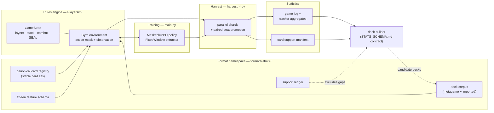

# Playersim

A reinforcement-learning engine and training pipeline for two-player *Magic: The
Gathering*.

**Mission.** Train an agent to play two-player Magic well enough that its games
yield *trustworthy* per-card and per-deck statistics, which feed a downstream
deck-construction AI searching for the best deck per format. Every design choice
is ranked by one question: *does it make the statistics more trustworthy for the
deck builder?*

Out of scope permanently: multiplayer, Commander, Planechase, and match play
(best-of-three is a possible late add only if a target format demands it).

The agent is trained with mask-aware PPO (Stable-Baselines3 + SB3-Contrib). The
current `combat-v5` training default progresses from passive goldfish through
novice/scripted mixtures; fixed evaluation remains scripted. The Harvest
protocol supports checkpoint-vs-checkpoint evaluation and promotion once a
checkpoint beats scripted play.

---

## Status

The rules engine, statistics pipeline, format/lineage plumbing, and training and
Harvest paths are operational and gated by a large regression suite. Rules and
card coverage are still expanding, and **no checkpoint has yet been shown to beat
scripted play**, so the statistics are not yet strength-grade.

[ROADMAP.md](ROADMAP.md) is the authoritative status and next-work list;
[STATS_SCHEMA.md](STATS_SCHEMA.md) is the contract for anything that consumes the
output statistics. `DeckStats_Viewer/` provides a dependency-free local
workbench for run provenance, checkpoint trends, every evaluation case and
debug replay, DeckStats scopes, canonical-ID CardMemory comparisons, safe
StrategyMemory diagnostics, game logs, fidelity, and Harvest artifacts. New
evaluation sidecars also expose bounded, explicitly non-causal Enhanced Card
Evaluator activity beside both players' atomic actions.
Launch it with
`.\MTGenv\Scripts\python.exe .\DeckStats_Viewer\MTG_Statistics_Viewer.py`.

> **Statistics collected before July 2026 are unusable** (wrong player, wrong
> winner, fabricated play turns, and several now-fixed stats-corrupting bugs).
> Wipe and re-harvest with the current engine.

---

## How it fits together


```mermaid
flowchart LR
    subgraph Engine["Rules engine — Playersim/"]
        GS["GameState<br/>layers · stack · combat · SBAs"]
        ENV["Gym environment<br/>action mask + observation"]
        GS --- ENV
    end
    subgraph Data["Format namespace — formats/&lt;fmt&gt;/"]
        REG["canonical card registry<br/>(stable card IDs)"]
        SCH["frozen feature schema"]
        DECKS["deck corpus<br/>(metagame + imported)"]
        LED["support ledger"]
    end
    subgraph Learn["Training — main.py"]
        POL["MaskablePPO policy<br/>FixedWindow extractor"]
    end
    subgraph Harvest["Harvest — harvest_*.py"]
        HV["parallel shards<br/>+ paired-seat promotion"]
    end
    subgraph Stats["Statistics"]
        LOG["game log +<br/>tracker aggregates"]
        MAN["card support manifest"]
    end
    REG --> ENV
    SCH --> ENV
    DECKS --> ENV
    ENV <--> POL
    ENV --> HV
    POL --> HV
    HV --> LOG
    HV --> MAN
    LOG --> BUILD["deck builder<br/>(STATS_SCHEMA.md contract)"]
    MAN --> BUILD
    LED -. excludes gaps .-> BUILD
    BUILD -. candidate decks .-> DECKS
```

- **Rules engine** (`Playersim/`) simulates phases, the stack, the layer system,
  combat, replacement effects, and state-based actions, and exposes the game as a
  masked Gym environment so only legal actions are ever selectable.
- **Format namespace** (`formats/<format>/`) pins the inputs a run depends on: a
  canonical card registry (stable, append-only card IDs keyed by name + Scryfall
  `oracle_id`), a frozen feature schema (fixed observation width), the deck
  corpus, and a static support ledger. Each artifact is versioned and self-hashed
  so adding cards cannot silently change model input width or invalidate a
  checkpoint.
- **Training** (`main.py`) runs mask-aware PPO, alternating the learned policy
  between seats, and writes a full provenance manifest per run.
- **Harvest** (`harvest_fixtures.py`, `harvest_protocol.py`) plays games to
  produce statistics; the parallel protocol also scores checkpoint promotions.
- **Statistics** are the product: an append-only game log, tracker aggregates,
  card-memory records, and a card-support manifest — all consumed by the
  downstream deck builder through the `STATS_SCHEMA.md` contract.

---

## Repository layout

```
main.py                     Training entry point (PPO, callbacks, provenance)
harvest_fixtures.py         Deterministic single-process Harvest + strict artifact validation
harvest_protocol.py         Parallel sharded Harvest and paired-seat promotion
ROADMAP.md                  Authoritative status and next-work list
STATS_SCHEMA.md             Output-statistics contract for the deck builder

Playersim/                  The engine + tooling package
  card.py, card_registry.py     Card model; canonical registry + frozen feature schema
  game_state*.py, layer_system.py, combat*.py, replacement_effects.py, targeting.py
  environment.py                Masked Gym environment
  actions*.py, ability_*.py     Action space, casting, choices, combat, mechanics
  deck_corpus.py, deck_ingest.py, deck_legality.py   Corpus hydration, import, legality
  support_preflight.py, card_support.py              Full-pool coverage ledger + manifest
  deck_stats_tracker.py, card_memory.py              Statistics aggregation
  strategic_planner*.py, enhanced_*.py, strategy_memory.py   Heuristic evaluation/planning

formats/standard/           Frozen Standard namespace (registry, schema, ledger, decks/)
Format Card Lists/          Pinned per-format card-pool snapshots (<format>.jsonl)
Mtg_Cards/                  Scryfall bulk card data
tests/                      Regression suites (see Verification)
MTGenv/                     Checked-in virtual environment (Windows)
```

---

## Setup

- **Python 3.11+** (developed and tested on 3.14).
- Dependencies: `pip install -r requirements.txt`
  (PyTorch, Stable-Baselines3 `[extra]`, SB3-Contrib, Gymnasium, Optuna,
  TensorBoard, NumPy, Matplotlib, psutil, GPUtil).

**GPU note.** The PyTorch build must match your GPU. The checked-in environment
uses a CUDA `cu130` wheel (`torch 2.12.1+cu130`) for an RTX 5060 (`sm_120`);
older CUDA wheels will not run that card. Pass `--cpu-only` to force CPU. When
more than one training environment is used, rollouts run in `SubprocVecEnv`
worker processes (Windows `spawn`).

On Windows the checked-in interpreter can be used directly as
`.\MTGenv\Scripts\python.exe` in place of `python`.

---

## Verification

Run these from the repository root before training or changing engine rules. The
current gate counts are tracked in [ROADMAP.md](ROADMAP.md).

The canonical delivery gate is:

```bash
python -m unittest discover -s tests -p "*_test.py"
python tests/scenario_test.py
python tests/smoke_test.py
python tests/train_smoke_test.py
python tests/invariant_fuzz_test.py --profile default
```

For the current Round 7.92 working tree, those gates are green at 428 unit
tests, 404 scenarios, 9/9 runtime smoke, 13/13 training smoke, and 8/8 default
fuzz seeds plus the phase-boundary check. The previously recorded long-fuzz
result remains historical until that scheduled/manual gate is rerun.

```bash
python tests/smoke_test.py                    # engine end-to-end (no training stack)
python tests/scenario_test.py                 # golden rules scenarios
python tests/layer_system_test.py             # continuous-effect/CDA regressions
python tests/multi_instruction_target_test.py # independent spell target slots
python tests/gift_target_parity_test.py        # conditional target/mask parity
python tests/action_catalog_test.py           # overflow response dispatch
python tests/mana_payment_test.py              # hybrid/snow/Phyrexian payment
python tests/mana_auto_tap_test.py             # restricted auto-tap parity
python tests/optional_discard_test.py          # optional discard continuations
python tests/deck_stats_numeric_test.py        # symbolic-stat analytics
python tests/strategic_planner_numeric_test.py # finite planner estimates
python tests/choice_context_test.py            # nested trigger/choice continuation
python tests/modok_warning_regression_test.py  # M.O.D.O.K. activation + warning paths
python tests/evoke_casting_test.py              # Evoke action/cost exposure
python tests/deceit_real_card_test.py           # colored ETBs + Evoke sequencing
python tests/landfall_runtime_test.py           # real Landfall gates/effects
python tests/leatherhead_colorstorm_test.py     # reflexive/Opus real-card paths
python tests/quantum_riddler_test.py             # batch draw replacements
python tests/superior_spider_man_test.py         # Mind Swap copy/exile lifecycle
python tests/prepared_test.py                    # Prepared copy/payment lifecycle
python tests/log_rules_runtime_test.py           # canary cost/land/cast-lock rules
python tests/aura_warning_regression_test.py     # Aura targets + warning no-ops
python tests/target_lifecycle_regression_test.py # legal-target/fizzle boundary
python tests/hearth_elemental_test.py             # graveyard-union cost reduction
python tests/doomsday_excruciator_test.py         # cast-only hidden exile lifecycle
python tests/momo_cost_reduction_test.py           # first eligible flying spell cost
python tests/bushwhack_fight_test.py               # role-aware two-creature fight
python tests/canary_effect_binding_test.py     # production-card effect binding
python tests/esper_origins_test.py             # Flashback-to-Saga real-card path
python tests/stack_integrity_test.py           # spell lifecycle/finalization
python tests/train_smoke_test.py              # PPO / SB3 integration
python tests/card_registry_test.py            # canonical registry + feature schema
python tests/deck_corpus_test.py              # corpus hydration
python tests/deck_ingest_test.py              # deck import + legality
python tests/support_preflight_test.py        # full-pool coverage ledger
python tests/harvest_fixtures_test.py         # single-process Harvest contract
python tests/harvest_protocol_test.py         # parallel Harvest + promotion
python tests/invariant_fuzz_config_test.py    # invariant harness config
python tests/invariant_fuzz_test.py --profile default   # 8 seeds x 1,000 actions
```

**Working agreement:** every engine change ships with a failing scenario written
*first*. Untested subsystems are assumed broken — this practice has repeatedly
surfaced phantom methods and dead/overfiring subsystems (see the ROADMAP
appendix bug catalog).

---

## Formats, decks, and lineage

A **format namespace** under `formats/<format>/` pins everything a run depends
on. Freeze one from a deck corpus:

```bash
python -m Playersim.card_registry freeze --decks <corpus_dir> --format standard \
  --output formats/standard
```

This writes `card_registry.json` (canonical card IDs) and `feature_schema.json`
(frozen card-vector layout), both versioned and self-hashed. Use `--extend` to
append new cards without renumbering existing IDs; a card that would widen the
frozen subtype vocabulary is rejected (that requires a new schema version, and
therefore a new checkpoint lineage).

The separate global policy-input contract is Observation v3, documented in
[OBSERVATION_SCHEMA.md](OBSERVATION_SCHEMA.md) and self-hashed by
`Playersim/observation_schema.py`.

Every run-level manifest (`training_run.json`, `harvest_run.json`,
`harvest_protocol.json`, `promotion.json`) stamps a `lineage` object recording
the format, pool-snapshot hash, corpus hash, card registry, card feature schema,
and observation schema versions + hashes. **Never merge statistics whose
lineage hashes differ** — they may disagree on card identity or on what the
policy observed. See
[STATS_SCHEMA.md](STATS_SCHEMA.md) → "Format namespaces and run lineage".

### Deck pool

The default training and Harvest pool is `formats/standard/decks/`, loaded
recursively. The pinned representative metagame lives under `metagame/`;
user-supplied decks live separately under `imported/`, so regenerating the
metagame can never overwrite an import. Harvest needs at least two decks in the
selected pool.

Regenerate the simulator-ready metagame files from the reviewable compact corpus
and the pinned card snapshot:

```bash
python -m Playersim.deck_corpus --replace
```

### Importing a deck list

Supply an Arena/simple-text list (`4 Card Name`, with optional `Deck`,
`Sideboard`, `Maybeboard` headings) or a compact JSON list:

```bash
python -m Playersim.deck_ingest path/to/my_deck.txt --dry-run   # validate only
python -m Playersim.deck_ingest path/to/my_deck.txt             # import
```

The importer resolves cards against the pinned snapshots; enforces 60-card
constructed legality, sideboard and copy limits, and a 1,000-card sanity cap;
and reports every matching format. Without `--format` it picks the narrowest
supported match in `Standard → Pioneer → Modern` order. A successful import
writes a hydrated deck to `formats/<format>/decks/imported/`, where training and
Harvest discover it through the recursive loader. `--strict-support` rejects
main-deck cards whose ledger status is `unparsed`, `crash`, or `excluded`;
`--replace` updates an existing named import. Sideboards are validated and
retained but not played by the best-of-one runtime; Maybeboards are ignored.

### Support ledger (coverage)

Before widening a format corpus, regenerate its static support ledger, which
classifies every card in the pool as verified, observed-clean, unseen-clean,
`partial`, `unparsed`, or `crash` — no card is called supported merely for never
having produced telemetry:

```bash
python -m Playersim.support_preflight \
  --snapshot "Format Card Lists/standard.jsonl" \
  --registry formats/standard/card_registry.json \
  --decks formats/standard/metagame_corpus_2026-07-11.json \
  --corpus-label representative-meta-2026-07-11 \
  --overrides formats/standard/support_overrides.json --format standard \
  --output formats/standard/support_ledger.json
```

The representative metagame currently has no `unparsed`/`crash` cards. Current
full-pool coverage counts are in the ROADMAP status snapshot.

---

## Training

```bash
python main.py --canary-config round-7.92 \
  --run-name round-7.92-combat-v5-v2
```

No format or deck flags are required for the pinned Standard default. Custom
corpora are available through `--decks`, `--format`, and `--format-dir`.
The named canary fails closed on its enumerated CLI and complete PPO setting
tree, reward contract version/scalars, the full resolved curriculum hash,
Observation/registry/feature/corpus identities, feature-output width, CUDA
device class, and evaluation-schedule hash. It checks one million timesteps,
learning rate `2e-4`, batch 256, rollout 1024, eight training environments,
100k evaluation cadence with 64 games (32 seat-swapped pairs), 50k
checkpoints, `combat-v5`, training seed `20260715`, and independent evaluation
seed `21260715`. Git/working-tree provenance, runtime libraries, and the specific
GPU model are recorded in `training_run.json` for comparison; the canary
selector does not constrain those audit variables or claim to hash every
implementation detail.

**Throughput.** Training is CPU-bound (the GPU learner needs seconds per
multi-minute rollout). Since Round 7.76 periodic evaluation runs
**asynchronously in a dedicated process**: the trainer saves a policy snapshot
at each `--eval-freq` boundary and keeps rolling while the evaluator scores it
(the pre-7.76 synchronous evaluator idled every worker — measured at **73% of
wall time** at the old defaults). Results land in TensorBoard on arrival;
`eval/evaluated_at_timesteps` records each score's true step. Use `--n-envs 8`
on a 6-core/12-thread machine (`--n-envs 0` auto-selects only 6; worker count
is RAM-bounded at ~0.3 MB per rollout-buffer step). If the evaluation cadence
outruns the evaluator, boundaries are skipped with a warning rather than
queueing stale snapshots. Skipped/cancelled boundaries are retained in
`evaluations.json`, and interrupted runs terminate the evaluator and remove
unpublished snapshots. Training workers batch compressed statistics for ten
games; close still forces a final flush. Deeper per-step optimizations are
tracked as the ROADMAP Tier 3 throughput program.

Every periodic evaluation uses the same paired deck/seat/seed cases, generated
from `--eval-seed` independently of training RNG. The 64-game Standard schedule
contains 32 seat-swapped pairs, has no mirrors, and balances learned decks,
opponent decks, and physical seats.
Promotion is ordered by decisive wins, decisive win-minus-loss score, fewer
turn limits, then shaped return. A candidate is only promoted to
`best_model.zip` after the pair-aware 95% lower confidence bound for its
decisive-win plus half non-timeout-draw score reaches 55%; the point estimate
alone cannot qualify it, and being merely best-so-far is recorded separately.
The bound uses a conservative envelope of the episode-level Wilson interval
and the paired-case t interval. The interval and exact cases,
per-game outcomes, checkpoint SHA-256, and promotion decisions are published
atomically to `logs/<run>/evaluation/evaluations.json`.

Strict training/evaluation fidelity also rejects nonzero effect-continuation
failure or lost-spell-recovery counters and retains their diagnostic contexts;
these recovery paths are not treated as clean merely because play continued.

Training and evaluation use separate statistics directories and alternate the
learned policy between P1 and P2 on successive episodes. Each run writes a
`training_run.json` provenance manifest under its model directory — seed, Git
revision and dirty state, CLI and resolved configuration, device and dependency
inventory, deck/lineage provenance, lifecycle result, and artifact paths. A
dirty run also stores a hashed `source_worktree.patch` beside the manifest,
including both tracked changes and untracked files.

Training workers continue to record card and deck outcomes, but adaptive
history is analytics-only by default: it does not feed evaluator advice back
into live training decisions. Evaluation uses the same history-free behavior,
so identical public states do not acquire worker-local meanings over time.
Recorded history uses canonical archetype labels and each seat's own turn
count, rather than deck names or the engine's alternating global turn.

> **Checkpoint boundary (Round 7.89 / Observation v3).** The full Standard namespace widened card
> observations to 436 fields (259 subtype fields plus MDFC fields), signed live
> power/toughness, and count/stat bounds large enough for legal boards above 20
> permanents. Round 7.62 also widened the declared choice-count, allocation, and
> X-range bounds to remove the old X ceiling. Stable-Baselines validates the
> complete observation space. Round 7.72 replaced the overlapping/dead
> shaping paths with one discounted state-potential reward and reduced the
> procedural action-reward scale. Round 7.73 rebalanced terminal rewards
> (turn-limit timeouts now pay win +2 / draw −4 / loss −8), cut the action
> reward scale to 0.02, and added symlog compression to every continuous
> extractor input. Round 7.76 doubled the network (1024-dim extractor,
> 512/256/128 heads). Round 7.80 reweighted the state potential toward
> offense with a convex damage ramp (`discounted-state-potential-v3`) and
> populated the previously-zero `potential_combat_damage` observation. Round
> 7.82 made planner observations state/perspective-fresh, repaired exact target
> and stack indexing, routed combat summaries through canonical legality/search,
> and added the previously-omitted rank-3 ability-recommendation extractor.
> Round 7.83 introduced Observation v2: categorical canonical-card embeddings,
> symmetric public zones and mana, library/player/permanent state, exact
> attachment/combat mappings, richer stack objects, observer-relative indices,
> and removal of exact/dead v1 duplicates. The online strategy-memory hint was
> also removed from policy input: the optional replacement is deterministic,
> isolated per environment, and disabled during training/evaluation. The
> observation hash is now part of run lineage. Round 7.84 completes the
> pre-training planner audit: observation reads no longer consume RNG,
> face-down cards cannot shape archetype inference, fake exact opponent-hand
> estimates and disabled action recommendations are removed, and the strategic
> metric vector contains only its seven live values. Round 7.85 keeps the same
> Observation v2 hash while repairing combat-lookahead state isolation, stale
> combat participants, Room unlock mask/payment parity, and Ba Sing Se's
> mandatory Earthbend target commitment. The failed July 14 `reward-v7` run is
> diagnostic-only. Round 7.86 keeps the Observation v2 hash but makes public
> combat damage mandatory, separates and snapshots first-strike/regular steps,
> preserves blocked status and end-of-combat participants, emits canonical
> all-target damage events, unifies printed/granted lifelink, opens overflow
> combat actions, and changes the reward lineage to
> `discounted-state-potential-v4` (all turn-limit outcomes pay `-6`). The
> interrupted `round-7.85-reward-v8` run skipped combat damage and is also
> diagnostic-only.
> The subsequent `round-7.86-combat-v4` run proved combat was reachable but
> exposed a terminal-perspective reward bug and a timeout-heavy
> training/evaluation objective. Round 7.87 introduces
> `discounted-state-potential-v5`: opponent-ended results are translated back
> to the learned seat, all timeouts and safety truncations pay `-10`, and
> handler-local action reward is diagnostic-only. Training now uses the
> deterministic, mastery-gated `combat-v2` opponent curriculum (passive
> goldfish, gradual passive/novice/scripted mixtures, then the full scripted
> pool), while evaluation remains a
> fixed 64-game scripted suite arranged as 32 seat-swapped pairs. PPO defaults
> are 2e-4 learning rate,
> 1,024 rollout steps, batch 256, gamma 0.999, lambda 0.98, value coefficient
> 0.25, and five epochs. Observation v2 and its hash are unchanged for that
> historical lineage.
> Round 7.91 introduced `discounted-state-potential-v6` and made `combat-v4`
> that round's fresh-run default: a life lead at the turn limit pays `-8` (all
> other limit outcomes stay `-10`), the convex damage-progress potential weight
> doubles to `0.80`, race/bridge open against epsilon-handicapped opponents
> that anneal to full strength on demonstrated win rate, and goldfish/race/
> bridge play to 20/20/25 turns. Mastery floors count only full-strength
> episodes. Evaluation remained fixed within each run, but Round 7.91 used a
> different training/evaluation seed, schedule, and worker count from Rounds
> 7.89/7.90, so its absolute scores are diagnostic rather than a controlled
> cross-round comparison.
> Round 7.94 replaces the discounted-state-potential family with
> `tempo-graded-potential-v1` after rounds 7.88-7.93 all converged on
> timeout-dominant play: decisive wins earn a bounded speed premium
> (`+10` up to `+14` by unused engine-turn budget), turn-limit stalls grade
> continuously on opponent damage (`-10` up to `-7`, result labels ignored),
> real draws pay `-3`, every step costs `0.005` reward, and the potential
> drops the hand-size term while making the convex damage ramp dominant
> (life-diff `0.10`, board `0.15`, damage weight `1.0`). Shaping remains
> strictly potential-based; resume and canary validation fail closed across
> the contract boundary.
> Round 7.95 introduces `combat-v7`, which halves the scripted handicap
> ratchet step to 0.10: round-7.94-tempo-v1 ping-ponged the scripted
> epsilon between 0.40 (~38% decisive wins, tightens) and 0.20 (~12%,
> relaxes), so the 0.20 step spanned the entire measured skill cliff. The
> novice ramp keeps its 0.25 step, and the `round-7.95` canary doubles the
> training horizon to 2M timesteps so each finer rung can earn its
> 48-episode window.
> Historically, Round 7.89 introduced `combat-v3`. Race mastery
> requires a novice win-rate floor, bridge requires separate novice and
> scripted floors, and passive opponents are absent from bridge. Explicit
> stage deadlines distinguish forced progression from mastery and guarantee
> entry into `full_pool` by approximately 375k timesteps. `combat-v2` remains
> available only to reproduce the earlier schedule.
> Round 7.92 makes `combat-v5` the fresh-run default. Goldfish receives 25
> turns, and the full-pool scripted profile anneals from epsilon `0.40` to
> full strength. Its qualifying scripted outcomes use their own rolling
> window, so the pool's interleaved novice games cannot starve the 24-sample
> ratchet. The pool is 80% scripted and 20% novice; both profiles were 100%
> active full-strength before this new scripted handicap. Round 7.92 also
> adds the enumerated named-canary checks, separates training/evaluation seeds,
> extends strict fidelity to failed continuations and lost-spell recoveries,
> and uses a pair-aware 95% lower-bound qualification gate.
> Stage selection applies on each worker's future reset; activation
> acknowledgements and stale-stage episode counts prevent old in-flight games
> from satisfying the next stage's minimum exposure clock.
> Observation v3 starts a fresh checkpoint lineage for Round 7.89: snow mana
> provenance, available-mana totals, land development, strategic resource
> magnitudes, win-condition viability, and default evaluator history isolation
> now have corrected semantics. Targetable vectors also follow the exact live
> target instruction, and adaptive turn analytics are player-relative.
> **Do not resume any pre-Round 7.89 checkpoint into this Observation v3
> lineage, including the failed `reward-v7`, `round-7.85-reward-v8`, or
> `round-7.86-combat-v4` artifacts.** Start fresh without `--resume`.

### Hyperparameter optimization

```bash
python main.py --optimize-hp
```

Automatically selects 10, 25, or 50 Optuna trials based on logical CPU count.

### Resuming / continuing a run

```bash
python main.py --resume models/<run>/final_model --timesteps 10000 \
  --curriculum none
```

(Only for manifest-verified, lineage-compatible checkpoints — see the boundary
note above. This command is only valid when the source run also recorded no
curriculum. Curriculum resume is rejected because per-worker matchup counters
are not checkpointed; current Observation v3 curriculum runs must start fresh.)

---

## Harvesting statistics

### Sample-deck fixture harvest

Rotates through the pinned decks, requires a fresh output directory, and rejects
reset fallbacks, degraded/out-of-space observations, mask-valid execution
failures, mask-invalid checkpoint choices, aborts, corrupt compressed data, and
cross-file count mismatches before writing `harvest_run.json` as its success
marker:

```bash
python harvest_fixtures.py --seed 20260710 --output harvest_runs/seed_20260710
```

The default policy is random-valid vs the scripted opponent. **These records
prove execution and telemetry coverage; their win rates are not card- or
deck-strength evidence.** Statistical harvest begins only after a trained
checkpoint beats scripted play.

### Checkpoint qualification, parallel harvest, and promotion

Production Harvest uses isolated worker directories and publishes
`harvest_protocol.json` only after every shard passes the strict fixture
contract. Checkpoints are stamped by filename, size, and SHA-256.

```bash
python harvest_protocol.py qualify --games 64 --workers 4 --seed 21260716 \
  --candidate models/candidate.zip --minimum-score 0.55 \
  --output harvest_runs/qualification_001

python harvest_protocol.py harvest --games 256 --workers 4 \
  --agent-model models/candidate.zip --opponent-model models/champion.zip \
  --output harvest_runs/candidate

python harvest_protocol.py promote --games 64 --workers 4 \
  --candidate models/candidate.zip --baseline models/champion.zip \
  --minimum-score 0.55 --output harvest_runs/promotion_001
```

For the paired qualification and promotion commands, `--games 64` means 64
total games: 32 with the candidate in each physical seat.

Qualification pairs the candidate against the scripted policy from both seats.
It writes an atomic `qualification.json` after both strict legs validate, counts
non-timeout draws as half a point, gives turn-limit life leads zero points, and
passes its current protocol gate at the default 55% point-score threshold with
zero fidelity counters and no `unparsed`/`crash` support entries. A completed
failed gate is recorded for audit and returns a nonzero command status; an
invalid or incomplete protocol never publishes the qualification manifest.
Every persisted game seat and worker-stamped checkpoint identity must agree,
and the checkpoint is re-hashed before publication so a changed candidate fails
closed.
The command exits `0` for a pass, `2` for a valid completed rejection, and `1`
for an invalid or incomplete protocol.

Final qualification is a separate held-out decision: use a seed and case suite
that were not used for training or periodic evaluation, and require the same
pair-aware 95% lower confidence bound to reach 55%. In this round the periodic
evaluator computes and persists that interval; `harvest_protocol.py qualify`
still enforces only its point-score threshold. A Harvest CLI pass is therefore
necessary but not sufficient final promotion evidence until that interval gate
is added to the protocol.

Promotion evaluates the candidate in both seats and requires both the score
threshold and a clean fidelity/severe-support manifest. `--decks`/`--format`/
`--format-dir` select the corpus. The protocol is ready; a real promotion needs
trained candidate and baseline checkpoints.

### Long-game invariant fuzzing

Deterministic profiles: `short` (300 actions), `default` (8,000), `long`
(320,000). A successful run leaves no artifact; a failure writes an atomic JSON
payload with the exact seed, actions, contexts, and state for one-command
replay.

```bash
python tests/invariant_fuzz_test.py --profile long --artifact-dir fuzz_failures
python tests/invariant_fuzz_test.py --replay fuzz_failures/invariant_fuzz_seed_1701.json
```

The long profile also runs weekly / on demand via
`.github/workflows/long-game-fuzz.yml`; failure replays are retained as CI
artifacts for 14 days.

---

## `main.py` command-line arguments

| Flag | Meaning | Default |
|---|---|---|
| `--timesteps` | Total training timesteps | `1000000` |
| `--seed` | Training seed (Python, NumPy, Torch, workers) | `20260715` |
| `--eval-seed` | Independent fixed-evaluation schedule seed | `21260715` |
| `--canary-config` | Validate the named, enumerated Round 7.92 launch contract | none |
| `--resume` | Path to a lineage-compatible checkpoint to continue | — |
| `--learning-rate` | Initial learning rate | `2e-4` |
| `--batch-size` | Batch size | `256` |
| `--n-steps` | Rollout steps before an update | `1024` |
| `--n-envs` | Parallel training environments (`0` = auto when explicitly supplied) | `8` |
| `--eval-freq` / `--eval-episodes` | Periodic cadence / games in fixed seat-swapped pairs | `100000` / `64` (32 pairs) |
| `--checkpoint-freq` | Checkpoint cadence (timesteps) | `50000` |
| `--curriculum` | Training opponent schedule (`combat-v5`, older reproducibility versions, or `none`) | `combat-v5` |
| `--format` / `--decks` / `--format-dir` | Format legality + corpus / deck dir / frozen namespace | pinned Standard |
| `--optimize-hp` | Run Optuna hyperparameter search | off |
| `--record-network` / `--record-freq` | Record network parameters / cadence | off / `5000` |
| `--run-name` | Short label folded into the run id and TensorBoard run name | none |
| `--cpu-only` | Force CPU even if a GPU is available | off |
| `--debug` | Extra debugging output | off |

---

## Monitoring

```bash
tensorboard --logdir=tensorboard_logs
```

Each training run groups its streams under one folder named
`MMDD-HHMMSS[_label]` (label from `--run-name`), containing `train` (policy
metrics), `system` (resource usage), and `network` (parameter recording when
enabled). The distinct part leads the name so runs stay tellable-apart in
TensorBoard's sidebar even when truncated.

Logged metrics include signed/absolute/nonzero reward components, raw action
and state-potential diagnostics, rollout critic target/value scales, decisive
outcomes, timeouts, valid-action counts, action distributions,
network-parameter changes, and CPU/GPU/
memory usage. All
time-series use policy timesteps as their x-axis. Terminal telemetry is reported
as both transition-normalized `terminal/*` metrics and episode-normalized
`terminal_episode/*`/`outcome/*` metrics. Terminal reward/result sign
mismatches have their own diagnostic counter; decisive and timeout rates are
also split under `opponent_profile/*` and `curriculum_stage/*`.

---

## Architecture notes and honest caveats

- **FixedWindowMTGExtractor** — a custom feature extractor over the heterogeneous
  observation (battlefield, hand, phase, life totals, resources).
  `CompletelyFixedMTGExtractor` remains only as a load-compatibility alias.
- **FixedDimensionMaskableActorCriticPolicy** — applies the legal-action mask so
  the policy can never select an illegal action.
- **Not recurrent.** The extractor's gated block applies an LSTM-shaped transform
  to a length-one input; its parameters train, but no hidden state is carried
  across policy calls. This is not yet a recurrent policy.
- **Curriculum opponent by default.** Training progresses from passive through
  novice to mostly scripted play; fixed evaluation always uses the scripted
  profile. Self-play / league play is gated on first beating scripted play.
- **Heuristic planning is opt-in.** Strategic-planner projections are available in
  the observation, but training does not inject a planner-selected action by
  default, and these features provide no cross-step memory.

---

## License

Apache License 2.0 — see [LICENSE](LICENSE). You may use, modify, and distribute
this software; retain the copyright notice and license, document significant
changes, and attribute the project.

## Acknowledgments

- [Stable-Baselines3](https://github.com/DLR-RM/stable-baselines3)
- [SB3-Contrib](https://github.com/Stable-Baselines-Team/stable-baselines3-contrib)
- [Gymnasium](https://github.com/Farama-Foundation/Gymnasium)
- Card data from [Scryfall](https://scryfall.com/).

## Contact

For questions or contributions, please open an issue on the GitHub repository.
