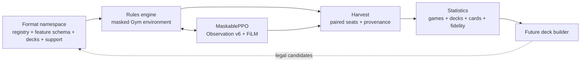

# Playersim

Playersim is a reinforcement-learning engine and training pipeline for
two-player *Magic: The Gathering*.

Its goal is to train an agent strong and reliable enough that simulated games
produce trustworthy card, deck, archetype, and matchup statistics for a future
format-aware deck builder.

Out of scope: multiplayer, Commander, Planechase, and match play. Best-of-three
may be added later if a target format requires it.

## Current status

The rules engine, masked Gym environment, training pipeline, deterministic
Harvest protocol, format namespaces, statistics, and support tooling are
operational.

The active experiment is `round-8.00-obs-v6-film-v1`. It starts fresh from
Observation v6 and tests whether explicit own-deck strategy conditioning helps
one shared policy pilot materially different archetypes. It keeps the Round
7.99 reward, curriculum, seeds, evaluation schedule, and checkpoint league
fixed.

No checkpoint has yet passed the held-out paired-seat strength gate, so current
statistics are engineering evidence, not production deck-strength evidence.
The automated deck-builder feedback consumer is also not connected yet.

Current policy boundary:

- Observation v6 adds `my_exact_deck_strategy_profile`, an observer-own
  `float32` vector with shape `(54,)` and bounds `0..1`.
- A dedicated 54-to-64 FiLM branch conditions the policy on that profile.
- The opponent's reviewed deck profile is never exposed; opponent inference
  uses public evidence only.
- Observation schema:
  `6521db9c0c70c919a63c34e9c99463a3b801e25ae91149fd518a34054989e790`.
- Extractor architecture:
  `179b31ea6925d112e0b527cd1f03aa15dae6a36a061d50c3f66c671c1028d9ab`.

Statistics produced before July 2026 are not trustworthy and must not be mixed
with current output.

See [ROADMAP.md](ROADMAP.md) for active work and exit criteria.

## System overview


```mermaid
flowchart LR
    F["Format namespace<br/>registry + feature schema + decks + support"]
    E["Rules engine<br/>masked Gym environment"]
    P["MaskablePPO<br/>Observation v6 + FiLM"]
    H["Harvest<br/>paired seats + provenance"]
    S["Statistics<br/>games + decks + cards + fidelity"]
    B["Future deck builder"]

    F --> E
    E <--> P
    E --> H
    P --> H
    H --> S
    S --> B
    B -. legal candidates .-> F
```

- `Playersim/` contains the rules engine, observations, actions, deck tooling,
  statistics, and support checks.
- `main.py` trains mask-aware PPO and records complete run provenance.
- `harvest_fixtures.py` and `harvest_protocol.py` validate checkpoints and
  produce deterministic statistics.
- `formats/<format>/` freezes canonical card IDs, feature layout, deck data,
  and support evidence.

## Setup

Requirements:

- Python 3.11 or newer.
- Dependencies from `requirements.txt`.
- A PyTorch build compatible with the selected GPU, or `--cpu-only`.

```powershell
pip install -r requirements.txt
.MTGenvScriptspython.exe .main.py --help
```

The checked-in Windows interpreter can replace `python` in every command.
Multi-environment training uses Windows `spawn` workers.

## Verification

Run the canonical delivery gate from the repository root:

```powershell
python -m unittest discover -s tests -p "*_test.py"
python tests/scenario_test.py
python tests/smoke_test.py
python tests/train_smoke_test.py
python tests/invariant_fuzz_test.py --profile default
```

Last verified:

| Gate | Result |
| --- | --- |
| Discovered unit tests | 873/873 |
| Golden scenarios | 409/409 |
| Runtime smoke | 9/9 |
| Training smoke | 14/14 |
| Fixture Harvest | 24/24 |
| Default invariant fuzz | 8 seeds x 1,000 actions plus phase-boundary check |

The 32-seed x 10,000-action long fuzz result is historical until its scheduled
or manual rerun.

Every engine defect fix must begin with a failing scenario. Parsing success or
a bounded probe is not proof that a card is semantically correct.

## Formats and decks

A format namespace pins:

- append-only canonical card identities;
- the frozen card-feature schema;
- the deck corpus;
- the static support ledger;
- lineage hashes used by training and Harvest.

The default namespace is `formats/standard/`. Its representative metagame
decks live under `decks/metagame/`; user imports live under
`decks/imported/`.

### Import a deck

```powershell
python -m Playersim.deck_ingest path	odeck.txt --dry-run
python -m Playersim.deck_ingest path	odeck.txt
```

The importer resolves canonical cards, enforces constructed legality, retains
but does not play sideboards, and writes the hydrated deck into the selected
format namespace. Use `--strict-support` to reject severe support gaps and
`--replace` to update an existing import.

### Rebuild the representative corpus

```powershell
python -m Playersim.deck_corpus --replace
```

Reviewed schema-v2 corpus decks must carry a valid strategy profile and hash.
Imported decks may omit one; the runtime then infers a deterministic profile
from the exact cardlist.

### Refresh support evidence

```powershell
python -m Playersim.support_preflight --snapshot "Format Card Lists/standard.jsonl" --registry formats/standard/card_registry.json --decks formats/standard/metagame_corpus_2026-07-11.json --corpus-label representative-meta-2026-07-11 --overrides formats/standard/support_overrides.json --format standard --output formats/standard/support_ledger.json
python -m Playersim.card_probe --snapshot "Format Card Lists/standard.jsonl" --registry formats/standard/card_registry.json --ledger formats/standard/support_ledger.json --format standard --output probe_runs/standard-current
```

Static-clean and bounded-probe results are triage evidence, not complete rules
proof. The deck builder must exclude `crash`, `unparsed`, and `excluded`
cards, and down-weight `partial` cards.

### Current Standard support state

No Standard card is fully supported under the semantic evidence contract:
`0/4,702` are verified and all `4,702` remain `semantic_status=unverified`.

The static ledger is only a first-pass inventory:

| Static status | Cards |
| --- | ---: |
| Observed clean | 119 |
| Unseen | 3,420 |
| Partial | 833 |
| Unparsed | 330 |

The latest complete schema-v3 full-pool probe
(`standard-full-schema3-repair1-2026-07-18-v3`) recorded:

| Bounded runtime result | Cards |
| --- | ---: |
| Execution passed | 48 |
| Coverage gap | 2,764 |
| Failed | 1,890 |

Those 48 execution passes are still not semantic verification. The probe checks
bounded production paths and records missing obligations; full support requires
assertion-bearing exact-state scenarios for every ability, mode, target,
choice, trigger, conditional branch, and relevant negative case.

Later targeted probes also remain bounded evidence:

- the July 21 Room/Exhaust set: 43 cards, 41 coverage gaps, 2 failures;
- the July 22 copied-card repair set: 3 cards, 3 coverage gaps, 0 failures.

The roadmap contains an explicit six-stage card-support completion step.

## Training

The active run uses:

| Setting | Value |
| --- | --- |
| Timesteps | 2,000,000 |
| PPO rollout / batch / learning rate | 1,024 / 256 / 2e-4 |
| Environments | 8 |
| Curriculum / reward | `combat-v7` / `tempo-graded-potential-v1` |
| Training / evaluation seed | `20260715` / `21260715` |
| Evaluation | 64 paired-seat games every 100k |
| Permanent checkpoints | every 500k |
| Self-play pool | 4 snapshots, refreshed every 100k |
| Checkpoint-opponent probability | 0.5 after activation |

Do not start a duplicate while the active run is in progress. Its exact argv,
resolved configuration, lineage, source revision, and artifacts live in:

`models/ALPHA_ZERO_MTG_V3.00_20260723_012347_round-8.00-obs-v6-film-v1/training_run.json`

Useful commands:

```powershell
python main.py --help
tensorboard --logdir=tensorboard_logs
.MTGenvScriptspython.exe .DeckStats_ViewerMTG_Statistics_Viewer.py
```

Resume is allowed only for a compatible, manifest-authorized ZIP checkpoint.
Curriculum resume remains disabled because all per-worker curriculum counters
are not checkpointed. Earlier observation or extractor architectures cannot be
resumed into Observation v6.

## Harvest and qualification

Fixture Harvest proves execution and telemetry integrity. Its random-valid
results are not strength evidence.

```powershell
python harvest_fixtures.py --seed 20260710 --output harvest_runs/seed_20260710
```

Checkpoint workflows:

```powershell
python harvest_protocol.py qualify --games 64 --workers 4 --seed 21260716 --candidate models/candidate.zip --minimum-score 0.55 --output harvest_runs/qualification_001
python harvest_protocol.py harvest --games 256 --workers 4 --agent-model models/candidate.zip --opponent-model models/champion.zip --output harvest_runs/candidate
python harvest_protocol.py promote --games 64 --workers 4 --candidate models/candidate.zip --baseline models/champion.zip --minimum-score 0.55 --output harvest_runs/promotion_001
```

Qualification and promotion use paired physical seats. Checkpoint-backed
Harvest requires the exact ZIP bytes to appear in the nearest
`training_run.json`, and validates Observation, extractor, registry, and
feature-schema lineage before loading.

The current Harvest CLI enforces its point-score threshold. Final acceptance
also requires the held-out pair-aware 95% lower confidence bound to reach 55%,
with zero fidelity counters and no severe support entries.

## Statistics and the deck builder

[STATS_SCHEMA.md](STATS_SCHEMA.md) defines the only supported builder input.
It covers:

- append-only game logs;
- per-deck and per-card aggregates;
- CardMemory diagnostics;
- archetype and matchup statistics;
- fidelity and support manifests;
- lineage and version checks.

The builder is not implemented as an automated consumer yet. Its intended loop
is:

1. generate a format-legal candidate;
2. infer the candidate's actual strategy profile;
3. evaluate it with a qualified policy from both seats;
4. reject fidelity-contaminated evidence;
5. update or promote the candidate from held-out statistics.

Generated candidates should keep their aspirational target profile separate
from the inferred profile supplied to the policy. Only reviewed or
deterministically classified strategy metadata may enter the observation.

## Lineage rules

Never merge checkpoints or statistics across mismatched:

- observation schema;
- feature-extractor architecture;
- canonical card registry;
- card feature schema;
- deck corpus;
- strategy taxonomy, classifier, or reviewed-profile aggregate.

Run manifests are authoritative. A matching tensor shape is not sufficient.

## Important limitations

- No checkpoint has passed the production strength gate.
- The automated deck-builder consumer is not connected.
- Card coverage is broad but semantically incomplete; unknown templates fail
  closed or raise fidelity evidence.
- Multi-blocker combat damage still uses a bounded automatic assignment.
- Sideboards are retained and legality-checked but not played.
- The fixed action space has 480 actions and pages overflow choices.
- The extractor is not recurrent: its LSTM-shaped block receives a length-one
  sequence and carries no hidden state between calls.

Detailed contracts and limitations belong in:

- [ROADMAP.md](ROADMAP.md) - current work and exit criteria;
- [OBSERVATION_SCHEMA.md](OBSERVATION_SCHEMA.md) - policy input;
- [ARCHETYPE_SCHEMA.md](ARCHETYPE_SCHEMA.md) - strategy profiles;
- [STATS_SCHEMA.md](STATS_SCHEMA.md) - statistics and builder consumption.

## Repository map

```text
Playersim/              engine and supporting tools
formats/                frozen format namespaces
tests/                  unit, scenario, smoke, Harvest, and fuzz gates
DeckStats_Viewer/       local statistics and provenance workbench
main.py                 training entry point
harvest_fixtures.py     strict single-process Harvest
harvest_protocol.py     parallel qualification, Harvest, and promotion
models/                 run-scoped model artifacts and manifests
logs/                   run-scoped logs and evaluation evidence
```

## License

Apache License 2.0. See [LICENSE](LICENSE).

Card data comes from [Scryfall](https://scryfall.com/). Training uses
[Stable-Baselines3](https://github.com/DLR-RM/stable-baselines3),
[SB3-Contrib](https://github.com/Stable-Baselines-Team/stable-baselines3-contrib),
and [Gymnasium](https://github.com/Farama-Foundation/Gymnasium).
