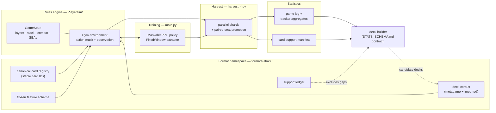

# Playersim

A reinforcement-learning engine and training pipeline for two-player *Magic: The
Gathering*.

**Mission.** Train an agent to play two-player Magic well enough that its games
yield *trustworthy* per-card and per-deck statistics, which feed a downstream
deck-construction AI searching for the best deck per format. Every design choice
is ranked by one question: *does it make the statistics more trustworthy for the
deck builder?*

Out of scope permanently: multiplayer, Commander, Planechase, and match play
(best-of-three is a possible late add only if a target format demands it).

The agent is trained with mask-aware PPO (Stable-Baselines3 + SB3-Contrib). The
current training default plays a scripted opponent; the Harvest protocol supports
checkpoint-vs-checkpoint evaluation and promotion once a checkpoint beats
scripted play.

---

## Status

The rules engine, statistics pipeline, format/lineage plumbing, and training and
Harvest paths are operational and gated by a large regression suite. Rules and
card coverage are still expanding, and **no checkpoint has yet been shown to beat
scripted play**, so the statistics are not yet strength-grade.

[ROADMAP.md](ROADMAP.md) is the authoritative status and next-work list;
[STATS_SCHEMA.md](STATS_SCHEMA.md) is the contract for anything that consumes the
output statistics. `DeckStats_Viewer/` is a legacy component from a much earlier
version, does not work, and is not part of the verification gates.

> **Statistics collected before July 2026 are unusable** (wrong player, wrong
> winner, fabricated play turns, and several now-fixed stats-corrupting bugs).
> Wipe and re-harvest with the current engine.

---

## How it fits together


```mermaid
flowchart LR
    subgraph Engine["Rules engine — Playersim/"]
        GS["GameState<br/>layers · stack · combat · SBAs"]
        ENV["Gym environment<br/>action mask + observation"]
        GS --- ENV
    end
    subgraph Data["Format namespace — formats/&lt;fmt&gt;/"]
        REG["canonical card registry<br/>(stable card IDs)"]
        SCH["frozen feature schema"]
        DECKS["deck corpus<br/>(metagame + imported)"]
        LED["support ledger"]
    end
    subgraph Learn["Training — main.py"]
        POL["MaskablePPO policy<br/>FixedWindow extractor"]
    end
    subgraph Harvest["Harvest — harvest_*.py"]
        HV["parallel shards<br/>+ paired-seat promotion"]
    end
    subgraph Stats["Statistics"]
        LOG["game log +<br/>tracker aggregates"]
        MAN["card support manifest"]
    end
    REG --> ENV
    SCH --> ENV
    DECKS --> ENV
    ENV <--> POL
    ENV --> HV
    POL --> HV
    HV --> LOG
    HV --> MAN
    LOG --> BUILD["deck builder<br/>(STATS_SCHEMA.md contract)"]
    MAN --> BUILD
    LED -. excludes gaps .-> BUILD
    BUILD -. candidate decks .-> DECKS
```

- **Rules engine** (`Playersim/`) simulates phases, the stack, the layer system,
  combat, replacement effects, and state-based actions, and exposes the game as a
  masked Gym environment so only legal actions are ever selectable.
- **Format namespace** (`formats/<format>/`) pins the inputs a run depends on: a
  canonical card registry (stable, append-only card IDs keyed by name + Scryfall
  `oracle_id`), a frozen feature schema (fixed observation width), the deck
  corpus, and a static support ledger. Each artifact is versioned and self-hashed
  so adding cards cannot silently change model input width or invalidate a
  checkpoint.
- **Training** (`main.py`) runs mask-aware PPO, alternating the learned policy
  between seats, and writes a full provenance manifest per run.
- **Harvest** (`harvest_fixtures.py`, `harvest_protocol.py`) plays games to
  produce statistics; the parallel protocol also scores checkpoint promotions.
- **Statistics** are the product: an append-only game log, tracker aggregates,
  card-memory records, and a card-support manifest — all consumed by the
  downstream deck builder through the `STATS_SCHEMA.md` contract.

---

## Repository layout

```
main.py                     Training entry point (PPO, callbacks, provenance)
harvest_fixtures.py         Deterministic single-process Harvest + strict artifact validation
harvest_protocol.py         Parallel sharded Harvest and paired-seat promotion
ROADMAP.md                  Authoritative status and next-work list
STATS_SCHEMA.md             Output-statistics contract for the deck builder

Playersim/                  The engine + tooling package
  card.py, card_registry.py     Card model; canonical registry + frozen feature schema
  game_state*.py, layer_system.py, combat*.py, replacement_effects.py, targeting.py
  environment.py                Masked Gym environment
  actions*.py, ability_*.py     Action space, casting, choices, combat, mechanics
  deck_corpus.py, deck_ingest.py, deck_legality.py   Corpus hydration, import, legality
  support_preflight.py, card_support.py              Full-pool coverage ledger + manifest
  deck_stats_tracker.py, card_memory.py              Statistics aggregation
  strategic_planner*.py, enhanced_*.py, strategy_memory.py   Heuristic evaluation/planning

formats/standard/           Frozen Standard namespace (registry, schema, ledger, decks/)
Format Card Lists/          Pinned per-format card-pool snapshots (<format>.jsonl)
Mtg_Cards/                  Scryfall bulk card data
tests/                      Regression suites (see Verification)
MTGenv/                     Checked-in virtual environment (Windows)
```

---

## Setup

- **Python 3.11+** (developed and tested on 3.14).
- Dependencies: `pip install -r requirements.txt`
  (PyTorch, Stable-Baselines3 `[extra]`, SB3-Contrib, Gymnasium, Optuna,
  TensorBoard, NumPy, Matplotlib, psutil, GPUtil).

**GPU note.** The PyTorch build must match your GPU. The checked-in environment
uses a CUDA `cu130` wheel (`torch 2.12.1+cu130`) for an RTX 5060 (`sm_120`);
older CUDA wheels will not run that card. Pass `--cpu-only` to force CPU. When
more than one training environment is used, rollouts run in `SubprocVecEnv`
worker processes (Windows `spawn`).

On Windows the checked-in interpreter can be used directly as
`.\MTGenv\Scripts\python.exe` in place of `python`.

---

## Verification

Run these from the repository root before training or changing engine rules. The
current gate counts are tracked in [ROADMAP.md](ROADMAP.md).

```bash
python tests/smoke_test.py                    # engine end-to-end (no training stack)
python tests/scenario_test.py                 # golden rules scenarios
python tests/layer_system_test.py             # continuous-effect/CDA regressions
python tests/multi_instruction_target_test.py # independent spell target slots
python tests/gift_target_parity_test.py        # conditional target/mask parity
python tests/action_catalog_test.py           # overflow response dispatch
python tests/mana_payment_test.py              # hybrid/snow/Phyrexian payment
python tests/mana_auto_tap_test.py             # restricted auto-tap parity
python tests/optional_discard_test.py          # optional discard continuations
python tests/deck_stats_numeric_test.py        # symbolic-stat analytics
python tests/strategic_planner_numeric_test.py # finite planner estimates
python tests/choice_context_test.py            # nested trigger/choice continuation
python tests/modok_warning_regression_test.py  # M.O.D.O.K. activation + warning paths
python tests/evoke_casting_test.py              # Evoke action/cost exposure
python tests/deceit_real_card_test.py           # colored ETBs + Evoke sequencing
python tests/landfall_runtime_test.py           # real Landfall gates/effects
python tests/leatherhead_colorstorm_test.py     # reflexive/Opus real-card paths
python tests/quantum_riddler_test.py             # batch draw replacements
python tests/superior_spider_man_test.py         # Mind Swap copy/exile lifecycle
python tests/prepared_test.py                    # Prepared copy/payment lifecycle
python tests/log_rules_runtime_test.py           # canary cost/land/cast-lock rules
python tests/aura_warning_regression_test.py     # Aura targets + warning no-ops
python tests/target_lifecycle_regression_test.py # legal-target/fizzle boundary
python tests/hearth_elemental_test.py             # graveyard-union cost reduction
python tests/doomsday_excruciator_test.py         # cast-only hidden exile lifecycle
python tests/momo_cost_reduction_test.py           # first eligible flying spell cost
python tests/bushwhack_fight_test.py               # role-aware two-creature fight
python tests/canary_effect_binding_test.py     # production-card effect binding
python tests/esper_origins_test.py             # Flashback-to-Saga real-card path
python tests/stack_integrity_test.py           # spell lifecycle/finalization
python tests/train_smoke_test.py              # PPO / SB3 integration
python tests/card_registry_test.py            # canonical registry + feature schema
python tests/deck_corpus_test.py              # corpus hydration
python tests/deck_ingest_test.py              # deck import + legality
python tests/support_preflight_test.py        # full-pool coverage ledger
python tests/harvest_fixtures_test.py         # single-process Harvest contract
python tests/harvest_protocol_test.py         # parallel Harvest + promotion
python tests/invariant_fuzz_config_test.py    # invariant harness config
python tests/invariant_fuzz_test.py --profile default   # 8 seeds x 1,000 actions
```

**Working agreement:** every engine change ships with a failing scenario written
*first*. Untested subsystems are assumed broken — this practice has repeatedly
surfaced phantom methods and dead/overfiring subsystems (see the ROADMAP
appendix bug catalog).

---

## Formats, decks, and lineage

A **format namespace** under `formats/<format>/` pins everything a run depends
on. Freeze one from a deck corpus:

```bash
python -m Playersim.card_registry freeze --decks <corpus_dir> --format standard \
  --output formats/standard
```

This writes `card_registry.json` (canonical card IDs) and `feature_schema.json`
(frozen observation layout), both versioned and self-hashed. Use `--extend` to
append new cards without renumbering existing IDs; a card that would widen the
frozen subtype vocabulary is rejected (that requires a new schema version, and
therefore a new checkpoint lineage).

Every run-level manifest (`training_run.json`, `harvest_run.json`,
`harvest_protocol.json`, `promotion.json`) stamps a `lineage` object recording
the format, pool-snapshot hash, corpus hash, and registry/schema
version + hash. **Never merge statistics whose lineage hashes differ** — they may
disagree on card identity or on what the policy observed. See
[STATS_SCHEMA.md](STATS_SCHEMA.md) → "Format namespaces and run lineage".

### Deck pool

The default training and Harvest pool is `formats/standard/decks/`, loaded
recursively. The pinned representative metagame lives under `metagame/`;
user-supplied decks live separately under `imported/`, so regenerating the
metagame can never overwrite an import. Harvest needs at least two decks in the
selected pool.

Regenerate the simulator-ready metagame files from the reviewable compact corpus
and the pinned card snapshot:

```bash
python -m Playersim.deck_corpus --replace
```

### Importing a deck list

Supply an Arena/simple-text list (`4 Card Name`, with optional `Deck`,
`Sideboard`, `Maybeboard` headings) or a compact JSON list:

```bash
python -m Playersim.deck_ingest path/to/my_deck.txt --dry-run   # validate only
python -m Playersim.deck_ingest path/to/my_deck.txt             # import
```

The importer resolves cards against the pinned snapshots; enforces 60-card
constructed legality, sideboard and copy limits, and a 1,000-card sanity cap;
and reports every matching format. Without `--format` it picks the narrowest
supported match in `Standard → Pioneer → Modern` order. A successful import
writes a hydrated deck to `formats/<format>/decks/imported/`, where training and
Harvest discover it through the recursive loader. `--strict-support` rejects
main-deck cards whose ledger status is `unparsed`, `crash`, or `excluded`;
`--replace` updates an existing named import. Sideboards are validated and
retained but not played by the best-of-one runtime; Maybeboards are ignored.

### Support ledger (coverage)

Before widening a format corpus, regenerate its static support ledger, which
classifies every card in the pool as verified, observed-clean, unseen-clean,
`partial`, `unparsed`, or `crash` — no card is called supported merely for never
having produced telemetry:

```bash
python -m Playersim.support_preflight \
  --snapshot "Format Card Lists/standard.jsonl" \
  --registry formats/standard/card_registry.json \
  --decks formats/standard/metagame_corpus_2026-07-11.json \
  --corpus-label representative-meta-2026-07-11 \
  --overrides formats/standard/support_overrides.json --format standard \
  --output formats/standard/support_ledger.json
```

The representative metagame currently has no `unparsed`/`crash` cards. Current
full-pool coverage counts are in the ROADMAP status snapshot.

---

## Training

```bash
python main.py --timesteps 1000000 --learning-rate 1e-4 --batch-size 512 \
  --n-steps 2048 --seed 20260713 --run-name reward-v1
```

No format or deck flags are required for the pinned Standard default. Custom
corpora are available through `--decks`, `--format`, and `--format-dir`.

Training and evaluation use separate statistics directories and alternate the
learned policy between P1 and P2 on successive episodes. Each run writes a
`training_run.json` provenance manifest under its model directory — seed, Git
revision and dirty state, CLI and resolved configuration, device and dependency
inventory, deck/lineage provenance, lifecycle result, and artifact paths. A
dirty run also stores a hashed `source_worktree.patch` beside the manifest.

> **Checkpoint boundary (Round 7.72).** The full Standard namespace widened card
> observations to 436 fields (259 subtype fields plus MDFC fields), signed live
> power/toughness, and count/stat bounds large enough for legal boards above 20
> permanents. Round 7.62 also widened the declared choice-count, allocation, and
> X-range bounds to remove the old X ceiling. Stable-Baselines validates the
> complete observation space. Round 7.72 then replaced the overlapping/dead
> shaping paths with one discounted state-potential reward and reduced the
> procedural action-reward scale. **Do not resume a checkpoint created before
> Round 7.72** — start fresh without `--resume`.

### Hyperparameter optimization

```bash
python main.py --optimize-hp
```

Automatically selects 10, 25, or 50 Optuna trials based on logical CPU count.

### Resuming / continuing a run

```bash
python main.py --resume models/<run>/final_model --timesteps 10000
```

(Only for lineage-compatible checkpoints — see the boundary note above.)

---

## Harvesting statistics

### Sample-deck fixture harvest

Rotates through the pinned decks, requires a fresh output directory, and rejects
reset fallbacks, degraded/out-of-space observations, mask-valid execution
failures, mask-invalid checkpoint choices, aborts, corrupt compressed data, and
cross-file count mismatches before writing `harvest_run.json` as its success
marker:

```bash
python harvest_fixtures.py --seed 20260710 --output harvest_runs/seed_20260710
```

The default policy is random-valid vs the scripted opponent. **These records
prove execution and telemetry coverage; their win rates are not card- or
deck-strength evidence.** Statistical harvest begins only after a trained
checkpoint beats scripted play.

### Checkpoint qualification, parallel harvest, and promotion

Production Harvest uses isolated worker directories and publishes
`harvest_protocol.json` only after every shard passes the strict fixture
contract. Checkpoints are stamped by filename, size, and SHA-256.

```bash
python harvest_protocol.py qualify --games 64 --workers 4 \
  --candidate models/candidate.zip --minimum-score 0.55 \
  --output harvest_runs/qualification_001

python harvest_protocol.py harvest --games 256 --workers 4 \
  --agent-model models/candidate.zip --opponent-model models/champion.zip \
  --output harvest_runs/candidate

python harvest_protocol.py promote --games 64 --workers 4 \
  --candidate models/candidate.zip --baseline models/champion.zip \
  --minimum-score 0.55 --output harvest_runs/promotion_001
```

Qualification pairs the candidate against the scripted policy from both seats.
It writes an atomic `qualification.json` after both strict legs validate, counts
draws as half a point, and passes only at the default 55% score threshold with
zero fidelity counters and no `unparsed`/`crash` support entries. A completed
failed gate is recorded for audit and returns a nonzero command status; an
invalid or incomplete protocol never publishes the qualification manifest.
Every persisted game seat and worker-stamped checkpoint identity must agree,
and the checkpoint is re-hashed before publication so a changed candidate fails
closed.
The command exits `0` for a pass, `2` for a valid completed rejection, and `1`
for an invalid or incomplete protocol.

Promotion evaluates the candidate in both seats and requires both the score
threshold and a clean fidelity/severe-support manifest. `--decks`/`--format`/
`--format-dir` select the corpus. The protocol is ready; a real promotion needs
trained candidate and baseline checkpoints.

### Long-game invariant fuzzing

Deterministic profiles: `short` (300 actions), `default` (8,000), `long`
(320,000). A successful run leaves no artifact; a failure writes an atomic JSON
payload with the exact seed, actions, contexts, and state for one-command
replay.

```bash
python tests/invariant_fuzz_test.py --profile long --artifact-dir fuzz_failures
python tests/invariant_fuzz_test.py --replay fuzz_failures/invariant_fuzz_seed_1701.json
```

The long profile also runs weekly / on demand via
`.github/workflows/long-game-fuzz.yml`; failure replays are retained as CI
artifacts for 14 days.

---

## `main.py` command-line arguments

| Flag | Meaning | Default |
|---|---|---|
| `--timesteps` | Total training timesteps | `1000000` |
| `--seed` | Base seed (Python, NumPy, Torch, workers, evaluation) | `42` |
| `--resume` | Path to a lineage-compatible checkpoint to continue | — |
| `--learning-rate` | Initial learning rate | `1e-4` |
| `--batch-size` | Batch size | `512` |
| `--n-steps` | Rollout steps before an update | `2048` |
| `--n-envs` | Parallel training environments (`0` = auto) | `0` |
| `--eval-freq` / `--eval-episodes` | Periodic evaluation cadence / episodes | `10000` / `20` |
| `--checkpoint-freq` | Checkpoint cadence (timesteps) | `50000` |
| `--format` / `--decks` / `--format-dir` | Format legality + corpus / deck dir / frozen namespace | pinned Standard |
| `--optimize-hp` | Run Optuna hyperparameter search | off |
| `--record-network` / `--record-freq` | Record network parameters / cadence | off / `5000` |
| `--run-name` | Short label folded into the run id and TensorBoard run name | none |
| `--cpu-only` | Force CPU even if a GPU is available | off |
| `--debug` | Extra debugging output | off |

---

## Monitoring

```bash
tensorboard --logdir=tensorboard_logs
```

Each training run groups its streams under one folder named
`MMDD-HHMMSS[_label]` (label from `--run-name`), containing `train` (policy
metrics), `system` (resource usage), and `network` (parameter recording when
enabled). The distinct part leads the name so runs stay tellable-apart in
TensorBoard's sidebar even when truncated.

Logged metrics include signed/absolute/nonzero reward components, raw action
and state-potential diagnostics, rollout critic target/value scales, win/
terminal rates, action distributions, network-parameter changes, and CPU/GPU/
memory usage. All
time-series use policy timesteps as their x-axis. Terminal telemetry is reported
both as cumulative `terminal/*_count` and normalized `terminal/*_rate`, so a
single ending is never shown as a permanent 100% rate.

---

## Architecture notes and honest caveats

- **FixedWindowMTGExtractor** — a custom feature extractor over the heterogeneous
  observation (battlefield, hand, phase, life totals, resources).
  `CompletelyFixedMTGExtractor` remains only as a load-compatibility alias.
- **FixedDimensionMaskableActorCriticPolicy** — applies the legal-action mask so
  the policy can never select an illegal action.
- **Not recurrent.** The extractor's gated block applies an LSTM-shaped transform
  to a length-one input; its parameters train, but no hidden state is carried
  across policy calls. This is not yet a recurrent policy.
- **Scripted opponent by default.** Training plays a scripted opponent; self-play
  / league play is gated on a checkpoint first beating scripted play.
- **Heuristic planning is opt-in.** Strategic-planner projections are available in
  the observation, but training does not inject a planner-selected action by
  default, and these features provide no cross-step memory.

---

## License

Apache License 2.0 — see [LICENSE](LICENSE). You may use, modify, and distribute
this software; retain the copyright notice and license, document significant
changes, and attribute the project.

## Acknowledgments

- [Stable-Baselines3](https://github.com/DLR-RM/stable-baselines3)
- [SB3-Contrib](https://github.com/Stable-Baselines-Team/stable-baselines3-contrib)
- [Gymnasium](https://github.com/Farama-Foundation/Gymnasium)
- Card data from [Scryfall](https://scryfall.com/).

## Contact

For questions or contributions, please open an issue on the GitHub repository.
